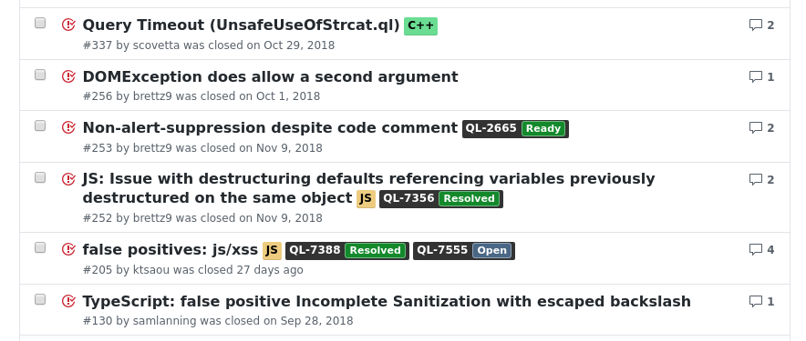

  

# Links for GitHub & Jira

Chrome extension that adds backlinks to JIRA issues from GitHub issues and PRs

When you view lists of issues or pull requests on GitHub (either GitHub.com, or GitHub enterprise), the extension will use the API of the JIRA installations of your choosing to see if there are any JIRA Issues that mention each GitHub Issue or PR. It will then insert these issues, along with their current status, right into the GitHub UI alongside the labels.

* It's not neccesary to install any plugins on JIRA.
* Authentication is done simply by acting as the user you are logged in as on JIRA.
* Minimal permissions required, only access to the relevant GitHub and JIRA websites.

TODO:

* Add JIRA links to single / individual issue / PR pages
* look for additional JIRA issue keys in the titles / descriptions of issues and PRs, and commit messages, and display links there too (probably download list of JIRA projects to do this)
* Add validation to the new form on the options page
* Add ability to edit existing entries
* Add icon / logo
* Display a warning on the icon when there are permissions missing
* Display a warning on the settings page when there are missing permissions, with ability to resolve
* Handle being logged out of JIRA gracefully, and display a warning to users on GitHub
